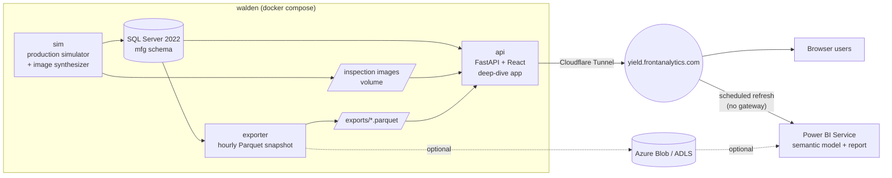
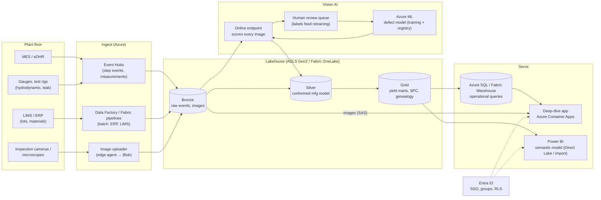

# Architecture

This repo runs a **deliberately light demo** (one Linux box plus Power BI) but the
design is the scaled-down version of a production architecture sized for
**thousands of valves per month and 20+ analysts, engineers and quality users**.
Both are described here. Every demo component has a named production counterpart,
so the demo is a subset of the real system, not a throwaway.

- [1. Demo (what runs today)](#1-demo-what-runs-today)
- [2. Production target](#2-production-target)
- [3. Demo → production mapping](#3-demo--production-mapping)
- [4. Sizing](#4-sizing)
- [5. Security, compliance and validation](#5-security-compliance-and-validation)
- [6. Cost](#6-cost)
- [7. Migration path](#7-migration-path)

---

## 1. Demo (what runs today)

| Component | What it does | Tech |
|---|---|---|
| `sim` | Builds a deterministic plan for every valve (52 steps, rework loops, scrap, measurements, images) and inserts events once their timestamps have passed. On first start this backfills a year of history; after that, new production appears every 15 minutes. | Python, Pillow |
| `db` | System of record. Same engine and T-SQL as Azure SQL, so the schema moves to Azure unchanged. | SQL Server 2022 Developer (container) |
| `api` | JSON API for the deep-dive app, image server, Parquet feed for Power BI, and the React build. | FastAPI, React + Vite + Recharts |
| `exporter` | Writes a star schema (5 dims, 3 facts) to Parquet every hour. It can also upload to Azure Blob. | pyarrow, azure-storage-blob |
| `tunnel` | Publishes the app at `yield.frontanalytics.com` without opening inbound ports. | cloudflared |
| Power BI | Semantic model (TMDL, in git) plus the report. Refreshes from the Parquet feed. | Power BI Service (Pro) |

**Why Power BI reads files rather than SQL.** If Power BI Service refreshed directly
from a database on a private box, it would need the on-premises data gateway, which
only runs on Windows. Instead we publish Parquet over HTTPS (or to Azure Blob), which
Power BI refreshes from the cloud with no gateway. The production design keeps the
same pattern: Power BI reads a curated lake layer, not the operational database.

### Why two front ends?

| Need | Power BI | Deep-dive app |
|---|---|---|
| Recurring KPIs, monthly reviews, distribution to management | ✅ best fit | – |
| Self-service slicing by engineers who know Power BI | ✅ | – |
| Looking at the actual inspection images, defect overlays, AI vs inspector | limited (thumbnails via image URL) | ✅ |
| Full device-history record for one serial number | awkward | ✅ |
| SPC with point-level drill to the unit | possible | ✅ one click |
| Embedding into MES / QMS workflows, write-back (dispositions, comments) | – | ✅ |

The two front ends are linked. Every Power BI fact row carries `unit_url` / `image_url`,
so a report can open a unit or an image in the app.

---

## 2. Production target

### Components

| Layer | Service | Notes |
|---|---|---|
| **Ingest: events** | Azure Event Hubs (Standard, 1–2 TU) | MES and test-rig adapters publish one message per step completion. Idempotent keys (`serial, step, attempt`) are the same as the demo's unique constraint. |
| **Ingest: batch** | Data Factory or Fabric Data Pipelines | Loads ERP/LIMS lot and material data nightly. |
| **Ingest: images** | Edge agent → Blob Storage (ADLS Gen2), Event Grid notification | Uploads full-resolution images (often 5–20 MB microscope TIFFs) and writes a thumbnail. Only the path goes into the database, never the image. |
| **Lake** | ADLS Gen2 (or Fabric OneLake) with bronze / silver / gold Delta tables | Silver is the conformed `mfg` model (same entities as the demo). Gold holds the yield, SPC and genealogy marts Power BI reads. |
| **Transform** | Fabric notebooks / Databricks / dbt on Fabric Warehouse | Incremental by `event_id`/watermark instead of the demo's full snapshots. |
| **Vision AI** | Azure ML (training, registry, managed online endpoint) or Azure AI Custom Vision to start | Every image gets a prediction and confidence. Disagreements and low-confidence images go to a review queue in the app, and the labels flow back into training. |
| **Operational DB** | Azure SQL Database (General Purpose, serverless 2–8 vCore) | Backs the deep-dive app's point queries (unit history, image lists). |
| **App** | Azure Container Apps (FastAPI + React image from this repo) | Entra ID authentication (Easy Auth), managed identity to SQL and Storage, images served through short-lived SAS URLs. |
| **BI** | Power BI Pro workspace (see licensing below), semantic model deployed from git via Fabric Git integration or deployment pipelines (dev → test → prod) | Row-level security by site/line using Entra groups. |
| **Identity** | Entra ID groups: `yield-viewers`, `yield-engineers`, `yield-quality`, `yield-admins` | Groups map to app roles and Power BI workspace roles/RLS. |
| **Ops** | Azure Monitor + Log Analytics, alerts on ingest lag, SPC rule violations and model drift | SPC violations (Western Electric rules) can also send Teams alerts. |
| **CI/CD** | GitHub Actions with OIDC federated credentials, Bicep | No stored cloud secrets. Environments: dev, test, prod. |

---

## 3. Demo → production mapping

| Demo | Production | Change needed |
|---|---|---|
| `sim` simulator | MES / gauge / camera adapters → Event Hubs | Replace the generator; the event schema stays the same |
| SQL Server container | Azure SQL (operational) + lakehouse (analytical) | Run `db/schema.sql` on Azure SQL; add Delta tables |
| Image volume on walden | ADLS Gen2 container + SAS URLs | Swap `FileResponse` for a SAS redirect |
| Synthetic `ai_class` | Azure ML endpoint prediction | Scoring job writes the same columns |
| Hourly full Parquet snapshot | Incremental Delta (gold layer) | Watermark by `event_id` |
| Cloudflare Tunnel + public app | Container Apps + Entra ID SSO (optionally Front Door) | Add auth middleware / Easy Auth |
| Power BI import from Parquet URL | Power BI import or Direct Lake from gold tables | Change the `Load Parquet` expression |
| `docker compose` on walden | Bicep + GitHub Actions per environment | `infra/` grows modules |

---

## 4. Sizing

| | Demo | Production target |
|---|---|---|
| Valves / month | ~100 | 1,000–5,000 |
| Step events / month | ~5,000 | 50k–300k (≈ 1–7 per minute average, bursty) |
| Images / month | ~500 (≈ 50 KB) | 5k–25k per camera station (5–20 MB each → 0.1–0.5 TB/month) |
| Users | a few | 20–50 named users, ~5–10 concurrent |
| Power BI model | < 5 MB | ~1–5 GB after 3 years at event grain. Pro caps a model at 1 GB, so either aggregate to daily/step grain for Pro or move to PPU/Fabric |

Nothing here needs big-data tooling. Event volume stays small; images are the
only real storage cost and belong in cheap blob tiers (cool after 90 days, archive after
retention review).

---

## 5. Security, compliance and validation

Heart valves are Class III medical devices, so the production system sits inside a
regulated quality system:

- **21 CFR Part 11 / EU Annex 11:** audit trail on any record a human changes (dispositions, AI-review labels), e-signatures where the app records a quality decision, time-synchronised timestamps, no silent edits (append-only events; corrections are new events).
- **21 CFR 820 (QMSR, ISO 13485-aligned):** the analytics platform is *non-product software used in the quality system* and needs a documented, risk-based validation (intended use, requirements, test evidence). Keeping dashboards "for information only", with the eDHR in MES as the system of record, keeps the validation burden low.
- **Data integrity (ALCOA+):** source-system IDs are kept end to end (`serial`, `event_id`), and lineage runs from bronze to gold.
- **Access:** Entra ID SSO, least-privilege groups, RLS in Power BI, private endpoints for SQL/Storage, managed identities (no passwords in config).
- **Retention:** device-history data for the life of the device plus the regulatory period (often 10+ years). Use immutable storage policies on the image container.

The demo uses **synthetic data only** and has none of these controls. It is not a validated system.

---

## 6. Cost

Rough monthly list prices (USD, East US 2, 2026). Validate with the Azure pricing calculator before quoting.

| Item | Demo | Production (20–50 users) |
|---|---|---|
| Compute for pipeline + app | walden (existing hardware) | Container Apps ~$30–80, Event Hubs Standard ~$25–50 |
| Operational database | SQL Server Developer (free, non-production) | Azure SQL serverless GP ~$150–400 |
| Lake / images | a few MB locally (Blob optional: cents) | ADLS Gen2 ~$20–60 per TB-month, tiered |
| Vision AI | – | Azure ML endpoint ~$150–400 (1 small CPU/GPU instance), training ad hoc |
| Power BI | 1 Pro license (~$14) | 20–50 Pro licenses (~$280–700); consider Fabric F64 (~$5k) only once there are hundreds of viewers or Direct Lake / larger models are needed |
| **Total** | **~$15/month** | **~$0.8k–2k/month** before Fabric |

---

## 7. Migration path

1. **Pilot (this repo):** run on walden with synthetic data, and use the Power BI report to agree the KPIs.
2. **Connect real data (read-only):** replace `sim` with an adapter reading an MES export (CSV/DB view) into the same schema, still on one box or in Azure SQL.
3. **Azure landing zone:** Bicep modules for Storage, SQL, Container Apps, Event Hubs and Key Vault; Entra ID groups; GitHub OIDC deploys.
4. **Images + AI:** stream images to ADLS, train the first defect model on labelled history, and add a review queue in the app.
5. **Scale and govern:** lakehouse layers, incremental loads, Power BI deployment pipelines, RLS, validation package.
