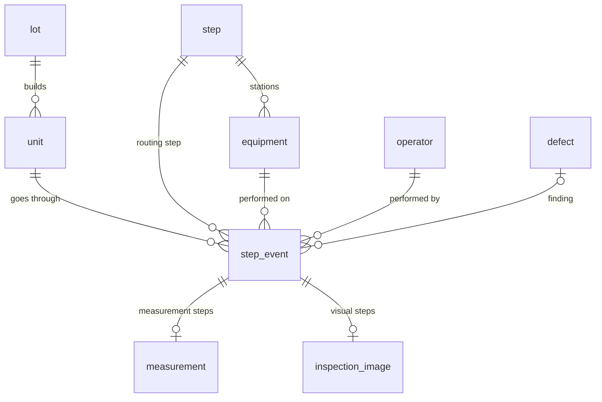

# Data model

Operational schema `mfg` (SQL Server / Azure SQL, `db/schema.sql`):

| Table | Grain | Notes |
|---|---|---|
| `step` | one of 52 routing steps | `step_type` = process / measurement / visual / gate (go-no-go); spec limits for measurements |
| `unit` | one valve (serial) | `status` wip / shipped / scrapped; `first_pass` = no fail or rework anywhere |
| `step_event` | one attempt at one step | unique `(serial, step_id, attempt)`; `result` pass / rework / scrap |
| `measurement` | value for a measurement event | 1:1 with `step_event` |
| `inspection_image` | image for a visual event | `true_class` = inspector disposition, `ai_class`/`ai_confidence` = model; bbox normalised 0..1 |

**Yield definitions**

- **Step FPY** = 1 − first-attempt fails ÷ first attempts at that step
- **Rolled throughput yield (RTY)** = ∏ Step FPY over all 52 steps
- **Unit first-pass yield** = completed units with no fail/rework ÷ completed units
- **Final yield** = shipped ÷ completed (after rework)
- **Cpk** = min(USL − μ, μ − LSL) ÷ 3σ, first attempts only

The Power BI feed (`exporter/export.py`) flattens this into `dim_*` and `fact_unit` / `fact_step_event` / `fact_inspection`.
